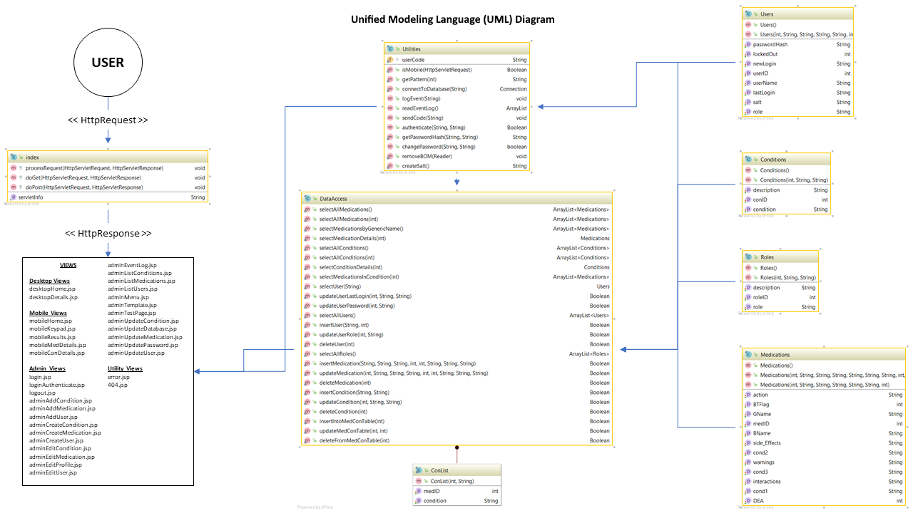
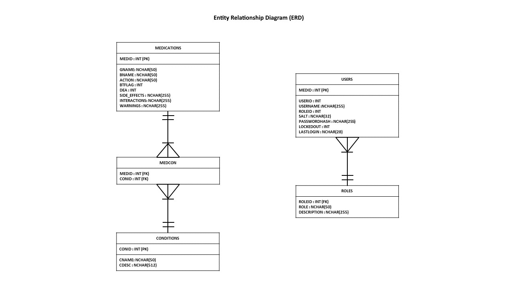

# Project Quick Medication Reference (QMR)

The Quick Medication Reference allows providers in the field to quickly identify commonly-prescribed medications to extrapolate patient histories and provide rapid and correct care.

## Table of Contents

- [Introduction](#introduction)
- [Requirement Analysis](#requirement-analysis)
- [System and Database Design](#system-and-database-design)
- [User Guide](#user-guide)
- [References](#references)

---

## Introduction

As a Firefighter/Emergency Medical Technician (EMT), I run into quite a few patients, especially the elderly, who have no idea what medications they take or what their medications actually do. When you hold up a pill bottle and ask the patient about it, they  will say something along the lines of, "I think that one is for my sugar (i.e., diabetes)," or "I felt bad and the doctor gave me this," etc. This lack of knowledge and understanding can obviously be dangerous.. For example, if I hold up a pill bottle labeled Apixaban, known as Eliquis, the patient may say, "That's for my legs." Eliquis is actually an anticoagulant used to treat cardiovascular issues, such as stroke or deep-vein thrombosis (DVT). A patient who has fallen may think they have a simple bruise, but if they are taking Eliquis, the patient may actually "bleed out" internally without realizing it, because anticoagulants keep the blood from clotting normally.

Therefore, I came up with a two-sided, laminated sheet of paper that lists and cross-references the brand name, generic name, and purpose of the top 200 medications that appear on pharmacists' certification tests. The list has worked from day one and has assisted my fellow first responders and I in identifying medications quickly, as well as getting a better picture of a patient's history.

I had wanted to create an electronic version of the list for a while, so I decided to do so as a project to fulfil my undergraduate capstone requirement. This way, I could have the list available on my phone when I entered the patient's home, instead of leaving the sheet in the ambulance. In addition, the electronic version includes more details about the medication, such as side-effects, etc. The project earned me an A and I still use it every shift. Therefore, I've decided to share the code, written for Java Server Pages (JSP), with you and I hope it will help you with your own work and projects!

---

## Requirement Analysis

|           |            |
|-----------|------------|
|**User:**      |EMS Provider|
|**Task:**      |I want to search for a medication using the medication's brand name and see its generic name and up to three (3) conditions treated by the medication|
|**Purpose:**   |To assist me in determining the medical history of a patient|
|**Condition:** |With a patient who cannot provide this information, in low light conditions, with one hand, while wearing surgical gloves, in a moving vehicle|
|**Standard:**  |I must retrieve the information in less than three inputs (e.g., clicks, etc.) and 10 seconds|
|**Priority:**  |Highest|
|**Validation:**|When the provider clicks or presses on the first letter in a medication's name, the program will look up all medications starting with that letter.|
|           |It will then display the medication, its generic name, and up to three (3) conditions treated by the medication|

---

|           |            |
|-----------|------------|
|**User:**      |EMS Provider|
|**Task:**      |I want to search for a medication using the medication's generic name and see its brand names and up to three (3) conditions treated by the medication|
|**Purpose:**   |To assist me in determining the medical history of a patient|
|**Condition:** |With a patient who cannot provide this information, in low light conditions, with one hand, while wearing surgical gloves, in a moving vehicle|
|**Standard:**  |I must retrieve the information in less than three inputs (e.g., clicks, etc.) and 10 seconds|
|**Priority:**  |Highest|
|**Validation:**|When the provider clicks or presses on the first letter in a medication's name, the program will look up all medications starting with that letter.|
|           |It will then display the medication, its brand names, and up to three (3) conditions treated by the medication|

---

|           |            |
|-----------|------------|
|**User:**      |EMS Provider|
|**Task:**      |I want to search for the medications used to treat a Condition |
|**Purpose:**   |To provide me with a list of possible medications a patient may be prescribed|
|**Condition:** |With a patient who cannot provide this information, in low light conditions, with one hand, while wearing surgical gloves, in a moving vehicle|
|**Standard:**  |I must retrieve the information in less than three inputs (e.g., clicks, etc.) and 10 seconds|
|**Priority:**  |High|
|**Validation:**|When the provider clicks or presses on the first letter in a condition's name, the program will look up all conditions starting with that letter.|
|           |It will then display both the brand name and generic medications used to treat the Condition |

---

|           |            |
|-----------|------------|
|**User:**      |EMS Supervisor|
|**Task:**      |I want to edit medication and condition information|
|**Purpose:**   |To ensure EMS providers have the most accurate data|
|**Condition:** |In an office environment|
|**Standard:**  |I must be an authenticated and authorized user|
|**Priority:**  |High|
|**Validation:**|User who have not logged in may not access the Edit Medication or Edit Condition pages.|
|           |After a successful login, an authenticated and authorized user may access the Edit Medication or Edit Condition pages.|
|           |After editing a medication or condition, the updated information appears when all users search for the medication or Condition |

---

|           |            |
|-----------|------------|
|**User:**      |EMS Supervisor|
|**Task:**      |I want to add medications and conditions|
|**Purpose:**   |To ensure EMS providers have the most accurate data|
|**Condition:** |In an office environment|
|**Standard:**  |I must be an authenticated and authorized user|
|**Priority:**  |High|
|**Validation:**|User who have not logged in may not access the Edit Medication or Edit Condition pages.|
|           |After a successful login, an authenticated and authorized user may access the Add Medication or Add Condition pages.|
|           |After editing a medication or condition, the new medication or condition appears when all users search for the medication or Condition |

---

|           |            |
|-----------|------------|
|**User:**      |EMS Supervisor|
|**Task:**      |I want to delete medications and conditions|
|**Purpose:**   |To ensure EMS providers have the most accurate data|
|**Condition:** |In an office environment|
|**Standard:**  |I must be an authenticated and authorized user|
|**Priority:**  |High|
|**Validation:**|User who have not logged in may not access the Edit Medication or Edit Condition pages.|
|           |After a successful login, an authenticated and authorized user may access the Delete Medication or Delete Condition pages.|
|           |After deleting a medication or condition, the medication or condition no longer appears when all users search for the medication or Condition |

---

|           |            |
|-----------|------------|
|**User:**      |EMS Provider|
|**Task:**      |I want to see additional information about a medication|
|**Purpose:**   |To determine if the medication is causing the emergency|
|**Condition:** |With a patient who cannot provide this information, in low light conditions, with one hand, while wearing surgical gloves, in a moving vehicle|
|**Standard:**  |I must retrieve the information in less than four inputs (e.g., clicks, etc.) and 20 seconds|
|**Priority:**  |Low|
|**Validation:**|When the provider clicks or presses on the medication's name, the program will display additional information (e.g., warnings, contraindications, etc.) about the medication|

---

## System and Database Design

---

## User Guide

Here is the original [User Guide](README/EMRUserGuide.pdf). Check out the site live at [http://sample-env.h3tq4n7wkp.us-east-1.elasticbeanstalk.com/](http://sample-env.h3tq4n7wkp.us-east-1.elasticbeanstalk.com/).

---

## References

- Pharmacy Tech Test. (2017). Top 200 drugs list to memorize. Retrieved March 1, 2018, from [http://www.pharmacy-tech-test.com/top-200-drugs.html](http://www.pharmacy-tech-test.com/top-200-drugs.html)
- U.S. National Library of Medicine. (2018). PubMed Health - National Library of Medicine. Retrieved March 1, 2018, from [https://www.ncbi.nlm.nih.gov/pubmedhealth/](https://www.ncbi.nlm.nih.gov/pubmedhealth/)
